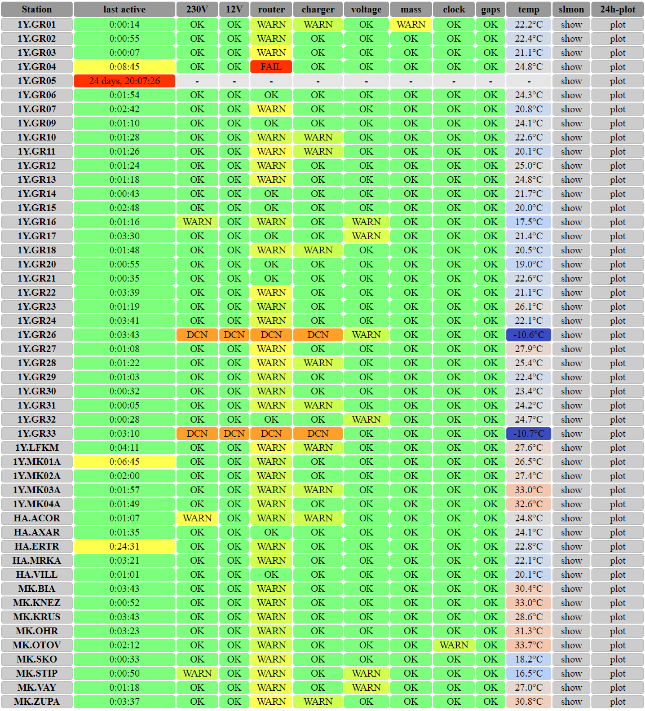

# survBot

version: 0.2

survBot is a small program used to track station quality channels of DSEBRA stations via PowBox output over SOH channels
 by analysing contents of a Seiscomp3 datapath.

 

## Requirements

The following packages are required:

* Python 3
* obspy
* pyyaml

(the following are dependencies of the above):

* numpy
* matplotlib

to use the GUI:

* PySide2, PyQt4 or PyQt5

## Usage

Configurations of *datapath*, *networks*, *stations* etc. can be done in the **parameters.yaml** input file.

The main program with html output is executed by entering

```shell script
python survBot.py -html path_for_html_output
```

There are example stylesheets in the folder *stylesheets* that can be copied into the path_for_html_output if desired.

The GUI can be loaded via

```shell script
python survBotGui.py
```

## Version Changes
- surveillance of mass, clock and gaps
- individual mailing lists for different stations
- html mail with recent status information
- updated web page design
- restructured parameter file
- recognize if PBox is disconnected

## Staff

Original author: M.Paffrath (marcel.paffrath@rub.de)

June 2023
